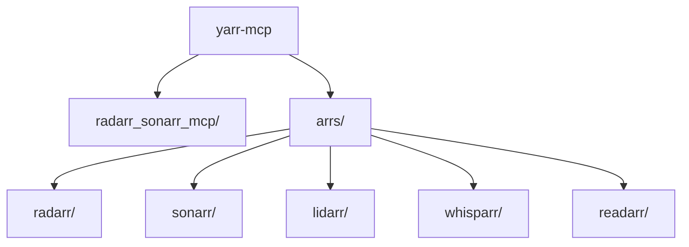

# Yarr MCP Server

[](https://pypi.org/project/radarr-sonarr-mcp/)
[](https://pypi.org/project/radarr-sonarr-mcp/)
[](https://opensource.org/licenses/MIT)

<p align="center">
  
  
  
  
  
  
  
</p>

Yarr is a Python-based [Model Context Protocol](https://github.com/modelcontextprotocol)
server that gives AI assistants natural‑language access to your media library. It
speaks to the full Arr family of services:

- **Radarr** for movies
- **Sonarr** for television series
- **Lidarr** for music
- **Readarr** for ebooks
- **Prowlarr** for indexer management
- **Whisparr** for adult content
- **Bazarr** for subtitles

The server currently focuses on Radarr and Sonarr but ships with lightweight client
stubs for the rest so support can easily be expanded.

For additional details on installing and configuring these services, consult the
[Servarr Wiki Reference](docs/servarr_wiki_reference.md).

## Features

- **Native MCP implementation** powered by FastMCP for seamless AI integration
- **Radarr & Sonarr integration** for querying your media collection
- **Whisparr/Lidarr/Readarr support** via reusable service clients
- **Rich filtering** by year, watched status, actors and more
- **Interactive configuration wizard** with secure keyring storage
- **Comprehensive test suite** for reliability

## Repository structure

```text
.
├── arrs/                     # Service clients for the Arr applications
│   ├── base.py               # Shared HTTP helpers
│   ├── lidarr/               # Lidarr client stub
│   │   └── __init__.py
│   ├── radarr/               # Radarr client
│   │   └── __init__.py
│   ├── readarr/              # Readarr client stub
│   │   └── __init__.py
│   ├── sonarr/               # Sonarr client
│   │   └── __init__.py
│   └── whisparr/             # Whisparr client stub
│       └── __init__.py
├── radarr_sonarr_mcp/        # Core MCP server implementation
│   ├── __init__.py
│   ├── cli.py                # Command line entry points
│   ├── config.py             # Configuration models
│   └── server.py             # FastMCP server
├── scripts/                  # Environment setup helpers
│   ├── setup_linux.sh
│   └── setup_windows.ps1
├── docs/                     # Project documentation
│   └── servarr_wiki_reference.md
├── tests/                    # Unit tests
│   ├── __init__.py
│   └── test_server.py
├── config.json.example       # Example configuration for MCP clients
├── run.py                    # Run the server without installation
├── run_tests.py              # Convenience test runner
├── requirements.txt          # Runtime dependencies
├── pyproject.toml            # Package metadata and entry points
├── setup.py                  # Legacy packaging metadata
├── uv.lock                   # Locked dependency versions
└── README.md                 # Project documentation (this file)
```

For additional details on installing and configuring these services, consult the [Servarr Wiki Reference](docs/servarr_wiki_reference.md).

## Architecture



## Installation

```bash
git clone https://github.com/yourusername/yarr-mcp.git
cd yarr-mcp
pip install -e .
```

## Configuration

Create a configuration file or run the interactive wizard:

```bash
radarr-sonarr-mcp configure
```

The wizard prompts for the host URL and API key for each service and stores the
values in `~/.yarr_config.json`.

## Running the server

```bash
radarr-sonarr-mcp start
```

By default the server listens on port `3000`. Add `http://localhost:3000` as an
MCP server in your client (e.g. Claude Desktop).

For quick local iteration you can run the server directly:

```bash
python run.py
```

## MCP Tools

### Movies
- `get_available_movies` – List movies with optional filters
- `lookup_movie` – Search by title
- `get_movie_details` – Detailed info for a movie

### Series
- `get_available_series` – List TV series with filters
- `lookup_series` – Search by title
- `get_series_details` – Detailed info for a series
- `get_series_episodes` – Episode list for a series

### Resources
- `/movies` – Browse all available movies
- `/series` – Browse all available TV series

Common filter parameters include `year`, `watched`, `downloaded`, `watchlist`,
`actors`, and `actresses`.

## Development

Install development dependencies and run the test suite:

```bash
pip install -e .[dev]
pytest
```

## License

MIT

